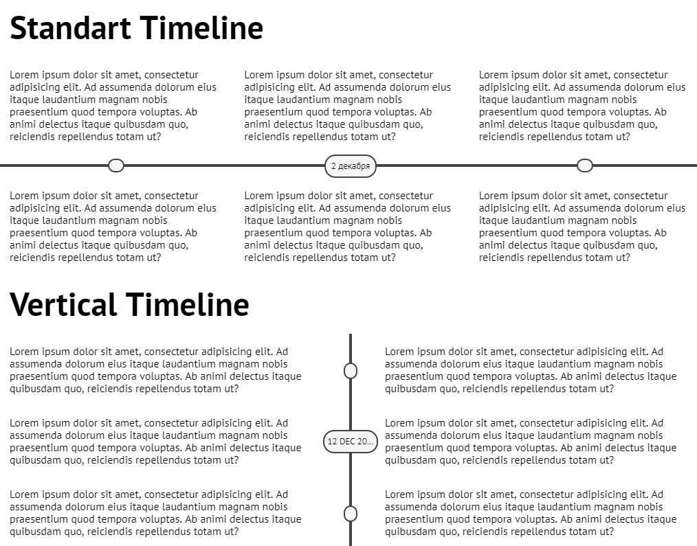

# Altrone Timeline Plugin

Этот плагин позволяет вам отобразить блоки, распределив их по временной линии. Плагин позволяет разместить временную линию горизонтально и
вертикально, а также поддерживает темную тему

## Элементы
* __timeline__ - основной блок
* __timeline__section__ - секция временной линии
* __timeline__section__item__ - элемент секции
* __timeline__section__circle__ - кружок, который отображает контрольную точку на временной линии. Должен располагаться между двумя __timeline__section__item__
* __timeline__section__label__ - аналогичен __timeline__section__circle__, только позволяет добавлять текст

## Модификаторы
* __timeline--vertical__ - Вертикальная ориентация
* __timeline--invert__ - Темная тема

## Установка
* Добавьте файл **altrone-timeline.css** к вашему проекту

## Пример
